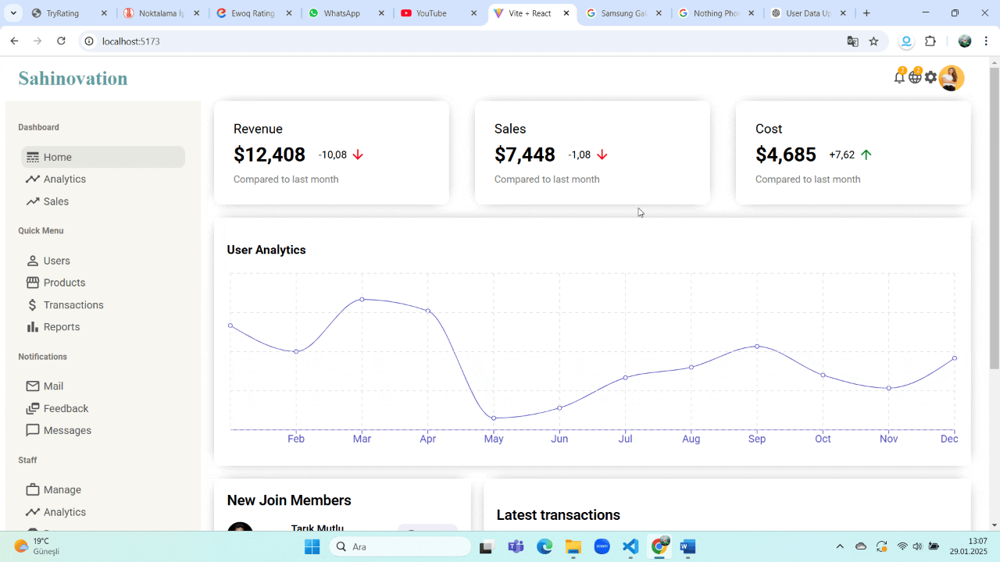

# React Admin Dashboard

This project is a **customizable** and **scalable** **React dashboard application** that allows website administrators to track various site-related data.  

## 🚀 Features  

- User management  
- Product management  
- Detailed statistics by category  
- Graphical data visualization  
- Modern UI powered by **Material UI**  

## 🛠 Technologies & Dependencies  

| Dependency | Description | NPM Link |
|------------|------------|----------|
| **React** (`react`, `react-dom`) | Core dependencies for building React applications. | [npm](https://www.npmjs.com/package/react)  |
| **React Router** (`react-router-dom`) | Enables routing and page navigation in the application. | [npm](https://www.npmjs.com/package/react-router-dom) |
| **Material UI** (`@mui/material`, `@mui/icons-material`) | Provides UI components and icons for a sleek design. | [npm](https://www.npmjs.com/package/@mui/material)  |
| **Emotion** (`@emotion/react`, `@emotion/styled`) | CSS-in-JS solution for advanced styling. | [npm](https://www.npmjs.com/package/@emotion/react) |
| **Data Grid** (`@mui/x-data-grid`) | High-performance data tables for handling large datasets. | [npm](https://www.npmjs.com/package/@mui/x-data-grid)  |
| **Recharts** (`recharts`) | Customizable chart components for data visualization. | [npm](https://www.npmjs.com/package/recharts) |

